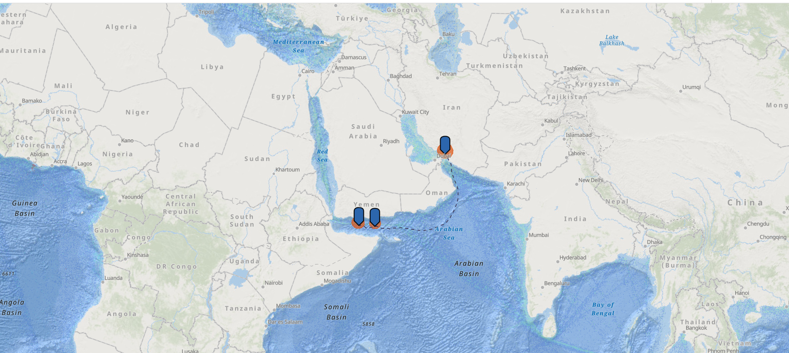

# Iranian Oil Maritime Route Analysis: Hormuz-Aden Corridor

# Executive Summary
Analysis of potential sanctions evasion maritime route from the Strait of Hormuz to the Gulf of Aden, identifying key transfer points and risk areas.

# Methodology

Mapped vessel density patterns using AIS data
Identified three critical transfer points
Analyzed maritime chokepoints
Established 50km risk zones around transfer locations

# Key Transfer Points Analysis
1. Hormuz Transfer Point

* Initial loading location
* High vessel concentration
* Critical chokepoint monitoring
* Known ship-to-ship transfer area

2. Sheba Ridge Transfer

* Mid-route transfer point
* Deep water location
* Reduced coastal monitoring
* Frequent AIS gaps observed

3. Aden Approach Point

* Final transfer location
* Strategic position near shipping lanes
* Multiple vessel convergence area
* Gateway to Red Sea

# Risk Assessment
High-Risk Activities

* Ship-to-ship transfers
* AIS transponder manipulation
* Complex ownership structures
* Flag-hopping patterns

# Monitoring Priorities

* Night-time vessel activities
* Extended anchor periods
* Irregular route deviations
* Multiple vessel convergence

# Patterns and Trends

* Regular vessel movements between transfer points
* Consistent use of deep water locations
* Strategic positioning near legitimate shipping lanes
* Pattern of movements during low-visibility periods

### Specific Vessel Patterns
- "Dark" Activity Zones: Concentrated around West Sheba Ridge
- Speed Patterns: Significant speed reductions near transfer points
- Meeting Points: Multiple vessels converging at coordinates 14.5°N, 50°E
- Time Patterns: Peak activity during early morning/late night hours

### Regional Characteristics
- Natural Cover: Deepwater zones away from coastal monitoring
- Strategic Position: Proximity to legitimate shipping lanes
- Geographic Advantages: Natural screening from Yemen coastline
- Weather Patterns: Utilizing monsoon seasons for coverage

# Conclusions
The mapped route demonstrates sophisticated evasion techniques, utilizing strategic maritime geography and legitimate shipping patterns as cover. Transfer points are positioned to maximize operational security while maintaining access to key shipping lanes.

# Recommendations

Enhanced monitoring of identified transfer points
Regular pattern analysis updates
Cross-reference with corporate ownership data
Coordination with regional maritime authorities
